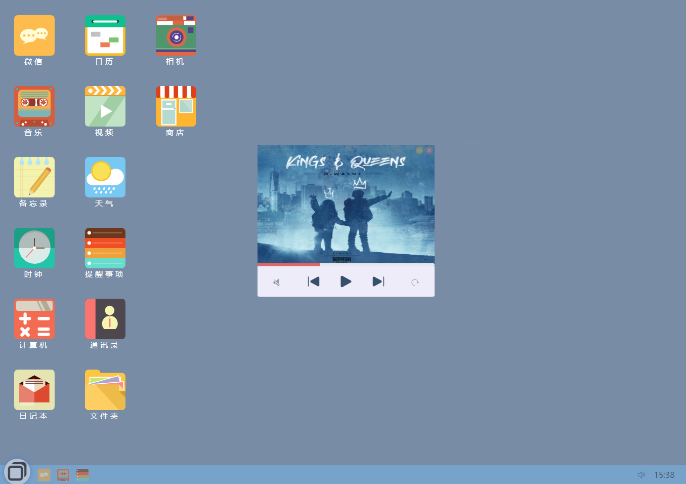

# HiOS仿桌面系统

#### 如何使用

```shell
//1.克隆项目到本地
git clone https://github.com/BugDesigner-Hy/HiOS.git
//2.安装依赖
npm i
//3.运行项目 或使用 vue ui 利用vue CLI的图形界面启动项目 默认8080端口
npm run serve
```

##### 说明 本项目中的音乐播放器使用的接口是[[网易云音乐Node版]( https://binaryify.github.io/NeteaseCloudMusicApi/#/ )]，要想正常使用音乐播放功能 需要将该项目部署到本地并启动才行 [具体步骤](https://binaryify.github.io/NeteaseCloudMusicApi/#/?id=%e5%ae%89%e8%a3%85)在这里

#### 目前完成的功能

- 桌面整体布局
- 任务栏绘制 包括开始菜单 喇叭 右下角时间
- 喇叭滑块绘制
- 时间显示 实时显示当前时间
- 应用窗口demo绘制
- 实现 点击应用 弹出应用界面 同时菜单栏出现应用对应小图标
- 实现应用最小化和关闭功能
- 实现应用屏幕拖拽功能
- 实现音乐播放器APP 接口调用【[网易云音乐欧美新歌速递](https://binaryify.github.io/NeteaseCloudMusicApi/#/?id=%e6%96%b0%e6%ad%8c%e9%80%9f%e9%80%92)】可上一首/下一首切歌 可暂停播放 可静音 可循环单曲 鼠标移到应用界面显示歌曲名和作者

#### 桌面效果



#### 未解决的问题及八阿哥[bug]:

1.激活当前应用没有出现在桌面的最上面

2.只实现了拖拽功能 没有实现自由缩放界面


